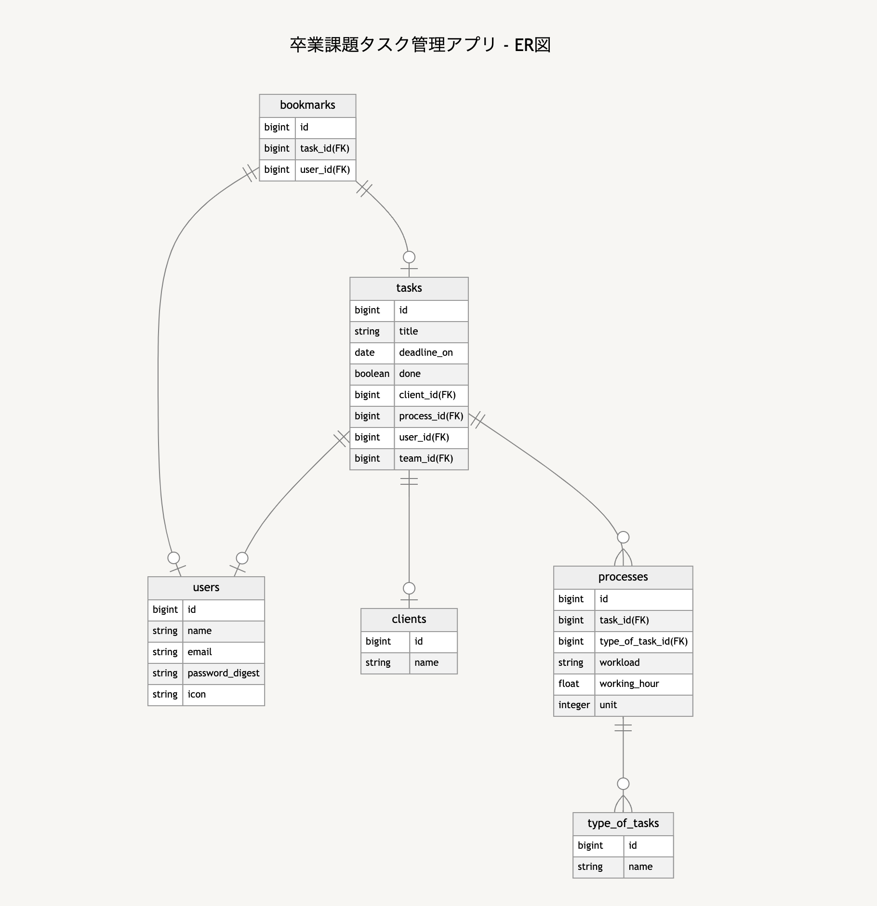

# README

## 開発言語
- Ruby 3.0.1
- Rails 6.1.7

## 追加したgem
| gem名 | 用途 |
----|----
| pry-rails | デバッグ用 |

## アプリケーションに取り入れる技術を就業Termで学んだ技術
- Ajaxを使ったコメント機能
- お気に入り機能

## カリキュラムで学んでいない技術
- OCR（文字認識機能）

## 要件定義書類のリンク
https://docs.google.com/spreadsheets/d/18jhyQsGz94CrCGKcy9IL_FdGcn9Aipd7XTc8KqNtE3s/edit#gid=0

ER図

画面遷移図
